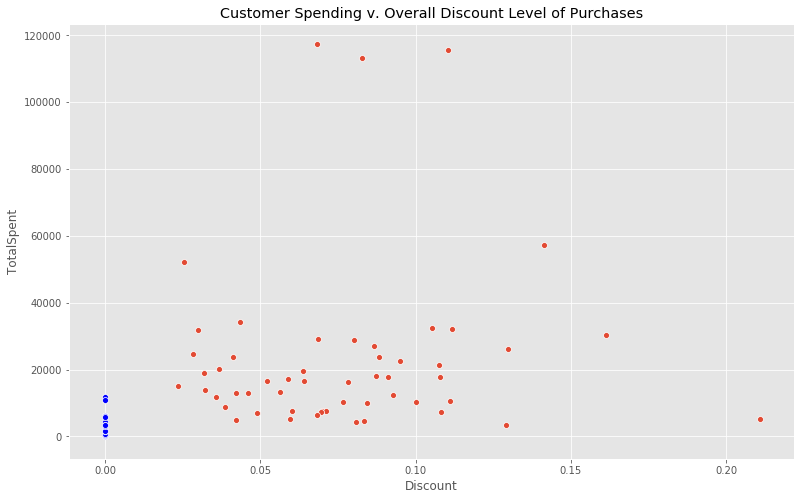
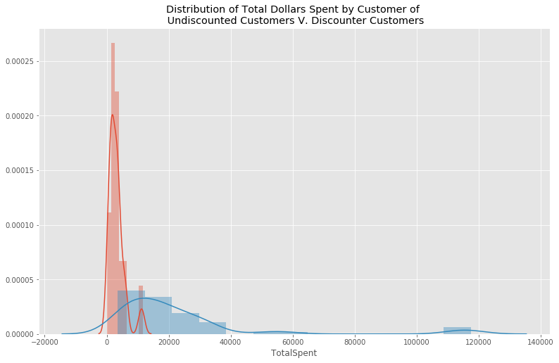
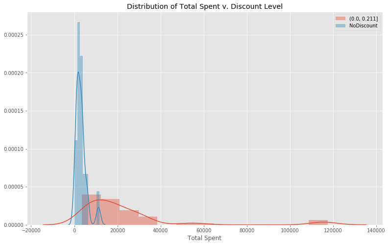
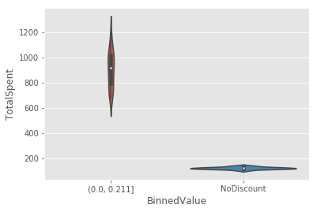

### Question 2
Does a customer's overall discount rate effect their total purchase amount? 

### Importing Python Module 


```python
from importlib import reload

import numpy as np
import pandas as pd

import sqlite3

# Removing red warnings
import warnings
warnings.filterwarnings('ignore')

# Power Analysis
from statsmodels.stats.power import tt_ind_solve_power,ttest_power

#For tukey test
from statsmodels.stats.multicomp import pairwise_tukeyhsd
from statsmodels.stats.multicomp import MultiComparison

#
import seaborn as sns
import matplotlib.pyplot as plt
plt.style.use('ggplot')
figsize = (13,8)

import function as func

import scipy.stats as scs

```

    ip
    


```python
conn = func.MyConn(filename= 'Northwind_small.sqlite')
```


```python
query =  """
            SELECT o.ID, CustomerID, ProductID, Quantity, Discount, UnitPrice
            FROM 'Order' as o
            JOIN 'OrderDetail' as od
            on o.ID = od.OrderID 
        """

```


```python
df = conn.load_query_as_df(query)

```


```python
df.CustomerId.describe()
```


    count      2155
    unique       89
    top       SAVEA
    freq        116
    Name: CustomerId, dtype: object


```python
# Adding the standard price
df['StandardPrice']= df.UnitPrice/(1- df.Discount)
# Line total
df['LineTotal'] = df.UnitPrice* df.Quantity
# Discounted Amount
df['StandardAmount'] = df.StandardPrice* df.Quantity
df.head()
```


<div>
<style scoped>
    .dataframe tbody tr th:only-of-type {
        vertical-align: middle;
    }

    .dataframe tbody tr th {
        vertical-align: top;
    }

    .dataframe thead th {
        text-align: right;
    }
</style>
<table border="1" class="dataframe">
  <thead>
    <tr style="text-align: right;">
      <th></th>
      <th>Id</th>
      <th>CustomerId</th>
      <th>ProductId</th>
      <th>Quantity</th>
      <th>Discount</th>
      <th>UnitPrice</th>
      <th>StandardPrice</th>
      <th>LineTotal</th>
      <th>StandardAmount</th>
    </tr>
  </thead>
  <tbody>
    <tr>
      <th>0</th>
      <td>10248</td>
      <td>VINET</td>
      <td>11</td>
      <td>12</td>
      <td>0.0</td>
      <td>14.0</td>
      <td>14.0</td>
      <td>168.0</td>
      <td>168.0</td>
    </tr>
    <tr>
      <th>1</th>
      <td>10248</td>
      <td>VINET</td>
      <td>42</td>
      <td>10</td>
      <td>0.0</td>
      <td>9.8</td>
      <td>9.8</td>
      <td>98.0</td>
      <td>98.0</td>
    </tr>
    <tr>
      <th>2</th>
      <td>10248</td>
      <td>VINET</td>
      <td>72</td>
      <td>5</td>
      <td>0.0</td>
      <td>34.8</td>
      <td>34.8</td>
      <td>174.0</td>
      <td>174.0</td>
    </tr>
    <tr>
      <th>3</th>
      <td>10249</td>
      <td>TOMSP</td>
      <td>14</td>
      <td>9</td>
      <td>0.0</td>
      <td>18.6</td>
      <td>18.6</td>
      <td>167.4</td>
      <td>167.4</td>
    </tr>
    <tr>
      <th>4</th>
      <td>10249</td>
      <td>TOMSP</td>
      <td>51</td>
      <td>40</td>
      <td>0.0</td>
      <td>42.4</td>
      <td>42.4</td>
      <td>1696.0</td>
      <td>1696.0</td>
    </tr>
  </tbody>
</table>
</div>


```python
columns = ['Quantity', 'LineTotal', 'StandardAmount', 'Discount']
df_customer = df.groupby('CustomerId')[columns].sum()
df_customer.Discount = (df_customer.StandardAmount- df_customer.LineTotal)/ df_customer.StandardAmount
df_customer = df_customer.rename(columns= {'LineTotal':'TotalSpent'})
df_customer.head()
```


<div>
<style scoped>
    .dataframe tbody tr th:only-of-type {
        vertical-align: middle;
    }

    .dataframe tbody tr th {
        vertical-align: top;
    }

    .dataframe thead th {
        text-align: right;
    }
</style>
<table border="1" class="dataframe">
  <thead>
    <tr style="text-align: right;">
      <th></th>
      <th>Quantity</th>
      <th>TotalSpent</th>
      <th>StandardAmount</th>
      <th>Discount</th>
    </tr>
    <tr>
      <th>CustomerId</th>
      <th></th>
      <th></th>
      <th></th>
      <th></th>
    </tr>
  </thead>
  <tbody>
    <tr>
      <th>ALFKI</th>
      <td>174</td>
      <td>4596.20</td>
      <td>5013.647368</td>
      <td>0.083262</td>
    </tr>
    <tr>
      <th>ANATR</th>
      <td>63</td>
      <td>1402.95</td>
      <td>1402.950000</td>
      <td>0.000000</td>
    </tr>
    <tr>
      <th>ANTO</th>
      <td>359</td>
      <td>7515.35</td>
      <td>8079.340523</td>
      <td>0.069807</td>
    </tr>
    <tr>
      <th>AROUT</th>
      <td>650</td>
      <td>13806.50</td>
      <td>14265.937822</td>
      <td>0.032205</td>
    </tr>
    <tr>
      <th>BERGS</th>
      <td>1001</td>
      <td>26968.15</td>
      <td>29523.261111</td>
      <td>0.086546</td>
    </tr>
  </tbody>
</table>
</div>


```python
func.plotset(title= 'Customer Spending v. Overall Discount Level of Purchases')
sns.scatterplot(x= 'Discount', y= 'TotalSpent', data= df_customer); 
sns.scatterplot(x= 'Discount', y= 'TotalSpent', data= df_customer.loc[df_customer.Discount == 0], color= 'blue'); 
```





There seems to be a distinct difference between discounted and non discounted, see blue markers on the plot. 


```python
df_customer.loc[df_customer.Discount != 0].corr()
```


<div>
<style scoped>
    .dataframe tbody tr th:only-of-type {
        vertical-align: middle;
    }

    .dataframe tbody tr th {
        vertical-align: top;
    }

    .dataframe thead th {
        text-align: right;
    }
</style>
<table border="1" class="dataframe">
  <thead>
    <tr style="text-align: right;">
      <th></th>
      <th>Quantity</th>
      <th>TotalSpent</th>
      <th>StandardAmount</th>
      <th>Discount</th>
    </tr>
  </thead>
  <tbody>
    <tr>
      <th>Quantity</th>
      <td>1.000000</td>
      <td>0.972739</td>
      <td>0.973827</td>
      <td>0.080549</td>
    </tr>
    <tr>
      <th>TotalSpent</th>
      <td>0.972739</td>
      <td>1.000000</td>
      <td>0.999041</td>
      <td>0.083154</td>
    </tr>
    <tr>
      <th>StandardAmount</th>
      <td>0.973827</td>
      <td>0.999041</td>
      <td>1.000000</td>
      <td>0.115591</td>
    </tr>
    <tr>
      <th>Discount</th>
      <td>0.080549</td>
      <td>0.083154</td>
      <td>0.115591</td>
      <td>1.000000</td>
    </tr>
  </tbody>
</table>
</div>


There isn't much correlation between discount level and TotalSpent dollars among the discounted customers. 


```python
func.plotset()
sns.distplot(df_customer.loc[df_customer.Discount == 0].TotalSpent);
sns.distplot(df_customer.loc[df_customer.Discount != 0].TotalSpent);
plt.title('Distribution of Total Dollars Spent by Customer of \n Undiscounted Customers V. Discounter Customers')
```


    Text(0.5, 1.0, 'Distribution of Total Dollars Spent by Customer of \n Undiscounted Customers V. Discounter Customers')





```python
reload(func)
```

    ip
    


    <module 'function' from 'C:\\Users\\FlatIron_User\\DataScience\\mod3\\dsc-mod-3-project-online-ds-ft-090919\\function.py'>


```python
func.df_binning(df_customer, column= 'Discount', bins=1)
df_customer.BinnedDiscount = df_customer.BinnedDiscount.astype(str)
df_customer.BinnedDiscount = df_customer.BinnedDiscount.replace(to_replace='nan', 
                                                                value='NoDiscount')

df_customer.head()
```


<div>
<style scoped>
    .dataframe tbody tr th:only-of-type {
        vertical-align: middle;
    }

    .dataframe tbody tr th {
        vertical-align: top;
    }

    .dataframe thead th {
        text-align: right;
    }
</style>
<table border="1" class="dataframe">
  <thead>
    <tr style="text-align: right;">
      <th></th>
      <th>Quantity</th>
      <th>TotalSpent</th>
      <th>StandardAmount</th>
      <th>Discount</th>
      <th>BinnedDiscount</th>
    </tr>
    <tr>
      <th>CustomerId</th>
      <th></th>
      <th></th>
      <th></th>
      <th></th>
      <th></th>
    </tr>
  </thead>
  <tbody>
    <tr>
      <th>ALFKI</th>
      <td>174</td>
      <td>4596.20</td>
      <td>5013.647368</td>
      <td>0.083262</td>
      <td>(0.0, 0.211]</td>
    </tr>
    <tr>
      <th>ANATR</th>
      <td>63</td>
      <td>1402.95</td>
      <td>1402.950000</td>
      <td>0.000000</td>
      <td>NoDiscount</td>
    </tr>
    <tr>
      <th>ANTO</th>
      <td>359</td>
      <td>7515.35</td>
      <td>8079.340523</td>
      <td>0.069807</td>
      <td>(0.0, 0.211]</td>
    </tr>
    <tr>
      <th>AROUT</th>
      <td>650</td>
      <td>13806.50</td>
      <td>14265.937822</td>
      <td>0.032205</td>
      <td>(0.0, 0.211]</td>
    </tr>
    <tr>
      <th>BERGS</th>
      <td>1001</td>
      <td>26968.15</td>
      <td>29523.261111</td>
      <td>0.086546</td>
      <td>(0.0, 0.211]</td>
    </tr>
  </tbody>
</table>
</div>


```python
func.plotset(title='Distribution of Total Spent v. Discount Level')

for i in df_customer.BinnedDiscount.value_counts().index:
    
    sns.distplot(df_customer.loc[df_customer.BinnedDiscount== i].TotalSpent, label= i,axlabel='Total Spent')
    plt.legend()

```





```python
df_discount = df_customer.groupby('BinnedDiscount')['TotalSpent', 'StandardAmount'].sum()
df_discount['CustomerCount'] = df_customer.groupby('BinnedDiscount')['Quantity'].count()
df_discount['AveragePerCustomer'] = df_discount.TotalSpent/ df_discount.CustomerCount
df_discount.head()
```


<div>
<style scoped>
    .dataframe tbody tr th:only-of-type {
        vertical-align: middle;
    }

    .dataframe tbody tr th {
        vertical-align: top;
    }

    .dataframe thead th {
        text-align: right;
    }
</style>
<table border="1" class="dataframe">
  <thead>
    <tr style="text-align: right;">
      <th></th>
      <th>TotalSpent</th>
      <th>StandardAmount</th>
      <th>CustomerCount</th>
      <th>AveragePerCustomer</th>
    </tr>
    <tr>
      <th>BinnedDiscount</th>
      <th></th>
      <th></th>
      <th></th>
      <th></th>
    </tr>
  </thead>
  <tbody>
    <tr>
      <th>(0.0, 0.211]</th>
      <td>1244123.19</td>
      <td>1.353620e+06</td>
      <td>54</td>
      <td>23039.318333</td>
    </tr>
    <tr>
      <th>NoDiscount</th>
      <td>110335.40</td>
      <td>1.103354e+05</td>
      <td>35</td>
      <td>3152.440000</td>
    </tr>
  </tbody>
</table>
</div>


#### Normalilty Shapiro Welk Test


```python
for i in df_customer.BinnedDiscount.value_counts().index:
    print(i)
    print(func.shapiro_normal(df_customer.loc[df_customer.BinnedDiscount == i].TotalSpent))
```

    (0.0, 0.211]
    non normal
    t 0.6238155364990234, p 1.635892254991944e-10
    NoDiscount
    non normal
    t 0.8218997716903687, p 5.651193714584224e-05
    

#### Test analysis
The null hypothesis is that the tested distribution is normally distributed, and the alternative hypothesis is that the distribution is non-normal. A p values threshold is 0.05. 

The p values for the bootstrap order data are below 0.05, so they are non normal. Bootstrapping will need to be use 


```python
df_mean_sampling = func.df_bootstrapping(df_customer, 'TotalSpent', bin_column='BinnedDiscount', num_of_samples= 35)
```


```python
sns.violinplot(x= 'BinnedValue', y= 'TotalSpent', data= df_mean_sampling);
```





```python

```

#### Normalilty Shapiro Welk Test


```python
for i in df_mean_sampling.BinnedValue.value_counts().index:
    print(i)
    print(func.shapiro_normal(df_mean_sampling.loc[df_mean_sampling.BinnedValue == i].TotalSpent))
```

    NoDiscount
    normal
    t 0.9752906560897827, p 0.6034384965896606
    (0.0, 0.211]
    normal
    t 0.9656100869178772, p 0.33439284563064575
    

#### Test analysis
The null hypothesis is that the tested distribution is normally distributed, and the alternative hypothesis is that the distribution is non-normal. A p values threshold is 0.05. 

*Null hypothesis was not rejected.* The p-values are above the threshold, so the distrbutions are normal. 


#### Variance Test


```python
func.levene_variances(df_mean_sampling.loc[df_mean_sampling.BinnedValue == 'NoDiscount'].TotalSpent,
                      df_mean_sampling.loc[df_mean_sampling.BinnedValue == '(0.0, 0.211]'].TotalSpent)

```

    p = 3.056001881201966e-12
    Therefore the data do not have equal variances
    


    False


#### Test analysis
The sample distributions don't have equal variances.

#### Welch T-test 


```python
scs.ttest_ind(df_mean_sampling.loc[df_mean_sampling.BinnedValue == 'NoDiscount'].TotalSpent,
                      df_mean_sampling.loc[df_mean_sampling.BinnedValue == '(0.0, 0.211]'].TotalSpent, equal_var=False)
```


    Ttest_indResult(statistic=-32.755609711106366, pvalue=1.8205935764474964e-27)


#### Test analysis
*Rejected the null hypothesis*(the sample means are identical)

#### Effect Size


```python
effect_size = func.cohen_d(df_mean_sampling.loc[df_mean_sampling.BinnedValue == '(0.0, 0.211]'].TotalSpent, 
             df_mean_sampling.loc[df_mean_sampling.BinnedValue == 'NoDiscount'].TotalSpent)
effect_size
```


    7.830088368581164


```python
tt_ind_solve_power(effect_size=effect_size, nobs1=35, alpha=0.5)
```


    1.0


```python
print(df_customer.loc[df_customer.Discount == 0].TotalSpent.mean()) 
print(df_customer.loc[df_customer.Discount != 0].TotalSpent.mean())
-df_customer.loc[df_customer.Discount == 0].TotalSpent.mean()+ df_customer.loc[df_customer.Discount != 0].TotalSpent.mean()
```

    3152.44
    23039.318333333336
    


    19886.878333333338


### Conclusion 
There is statistical signficant difference in total dollars spent with customers that recieved discount and those that did not. There is a $19,886.88 positive increase the average of the non discounted customer to the discounted customers Among the discounted customer, there did not seem to be a signficant relationship between the indiv


```python

```


```python
reload(func)
```

    ip
    


    <module 'function' from 'C:\\Users\\FlatIron_User\\DataScience\\mod3\\dsc-mod-3-project-online-ds-ft-090919\\function.py'>


```python

```
