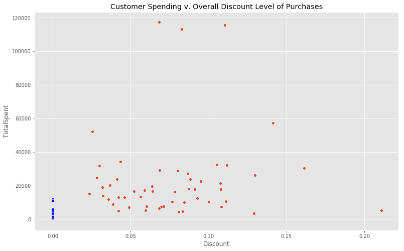
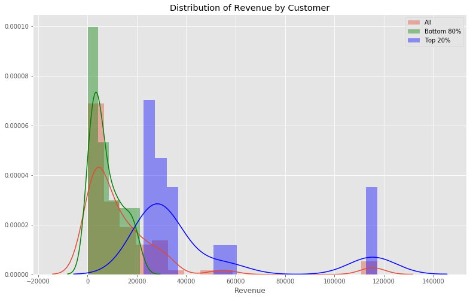
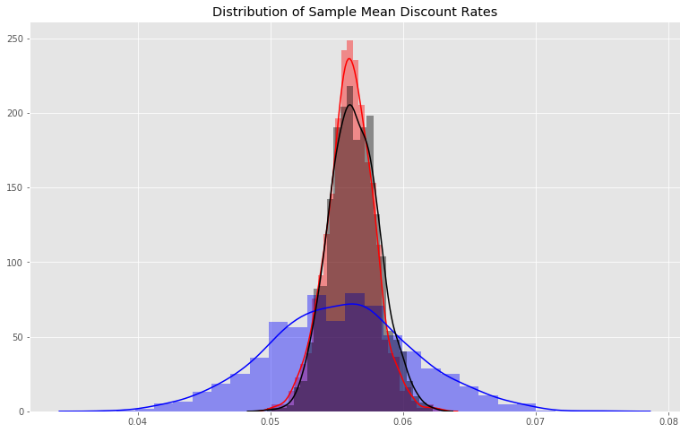
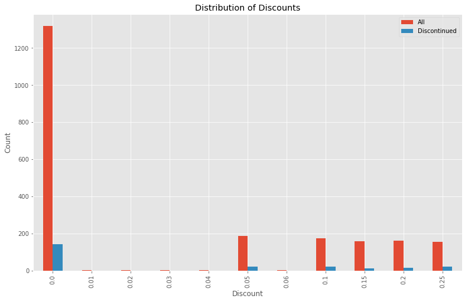
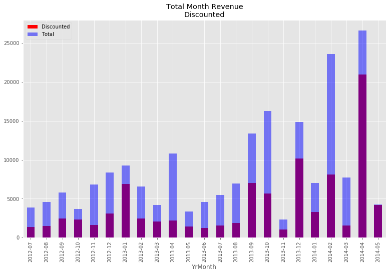
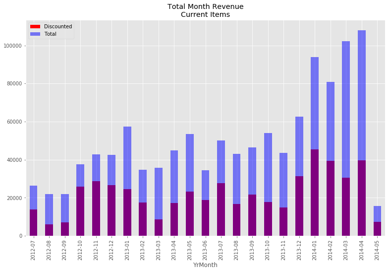

# Introduction
This project examines the Northwind Sample database provided by Microsoft used for training purpose. We need ask 4 questions that require hypothesis testing to answer. Below is a diagram of database.

<!---you can put in images using an img tag--->


I am asking the following questions

-**Does discount amount have a statistically significant effect on the quantity of a product in an order? If so, at what level(s) of discount?** 
    <a href='question1.ipynb'>Question 1</a>
    
-**Does a customer's overall discount rate effect their total purchase amount?**
    <a href='question2.ipynb'>Question 2</a>

-**Does the Northwind Customer database conform to the 80/20 rule? 80% of your sales is accounted for by 20% of your customers.**
    <a href='question3.ipynb'>Question 3</a>

-**Are discontinued items have a difference discount rate compared to the rest of the items?**
    <a href='question4.ipynb'>Question 4</a>

### Question 1
Does discount amount have a statistically significant effect on the quantity of a product in an order? If so, at what level(s) of discount?


<details><summary>Initial Procedure</summary>
    
**Gathering my data**

I used the below SQL command to gather data from the Order and OrderDetail. Also the total item amount and standard undiscounted line amount were calulated.

```
query = """
            SELECT o.ID, ProductID, Quantity, Discount, UnitPrice
            FROM 'Order' as o
            JOIN 'OrderDetail' as od
            on o.ID = od.OrderID"""

df = sql_to_dataframe(query)
df.head()
# Adding the standard price
df['StandardPrice']= df.UnitPrice/(1- df.Discount)
# Line total
df['LineTotal'] = df.UnitPrice* df.Quantity
# Discounted Amount
df['StandardAmount'] = df.StandardPrice* df.Quantity
```
Then I grouped the data by order.
```
columns = ['Quantity', 'LineTotal', 'StandardAmount', 'Discount']
Orders = df.loc[df.Discount == 0].groupby('Id')[columns].sum()
````

**Split up data if it had a discount or not**
```
columns = ['Quantity', 'LineTotal', 'StandardAmount', 'Discount']
orders_with_no_discount = df.loc[df.Discount == 0].groupby('Id')[columns].sum()
orders_with_discount = df.loc[df.Discount != 0].groupby('Id')[columns].sum()
```


**Split further into different levels of discount rates**

I calulated the discounted rate for each order and then binned discount rates into different levels.
```
orders_with_discount.Discount = (orders_with_discount.StandardAmount- orders_with_discount.LineTotal)/ orders_with_discount.StandardAmount 
df_orders = orders_with_discount.append(orders_with_no_discount)
hist, bin_edge = np.histogram(df_orders.Discount, bins= 3)
#bin_edge[1]=.0725
df_orders['BinnedDiscount'] = pd.cut(df_orders['Discount'], bin_edge)
df_orders.BinnedDiscount = df_orders.BinnedDiscount.astype(str)
df_orders.BinnedDiscount.loc[df_orders.BinnedDiscount == 'nan']= 'No Discount'
df_orders = df_orders.sort_values('Discount')
```


**Compare Distributions and test for normality**

*Ho:* The tested distribution is normally distributed.

*Ha:* The tested distribution is not normally distributed

```
No Discount
non normal
t 0.7845940589904785, p 1.1666289823246571e-27
(0.0833, 0.167]
non normal
t 0.8421576023101807, p 2.0802779637785207e-11
(0.167, 0.25]
non normal
t 0.8608901500701904, p 2.496944873087159e-10
(0.0, 0.0833]
non normal
t 0.8759969472885132, p 6.426521395042073e-07
```

*The null hypothesis is rejected.* The p values for the order data is below 0.05, so they are not normal. We will use bootstrapping take a sampling distribution of the means.
</details>

<details><summary>Mean Sampling(Bootstrapping)</summary>
Mean samples were taken of all binned values. The number of sample in each binned value category was the same number of the actual sample. See below sample distributions.


**Compare Distribution and test for normality**

*Ho:* The tested distribution is normally distributed.

*Ha:* The tested distribution is not normally distributed

```
No Discount
normal
t 0.9924347400665283, p 0.9050273895263672
(0.0833, 0.167]
normal
t 0.9831403493881226, p 0.3255539536476135
(0.167, 0.25]
normal
t 0.982770562171936, p 0.3085521161556244
(0.0, 0.0833]
normal
t 0.986225962638855, p 0.4969947636127472
```

*Failed to rejected null hypothesis.* The p values are above 0.05, so they a. We will use bootstrapping take a sampling distribution of the means.

**Equal Variance Test**

*Ho:* The two tested distribution have equal variance.

*Ha:* The two tested distribution do not have equal variance.
```
No Discount compared to No Discount
p = 1.0
Therefore the data have equal variances
True
No Discount compared to (0.0833, 0.167]
p = 3.502923887293742e-06
Therefore the data do not have equal variances
False
No Discount compared to (0.167, 0.25]
p = 5.99797771714921e-07
Therefore the data do not have equal variances
False
No Discount compared to (0.0, 0.0833]
p = 1.321440131263909e-08
Therefore the data do not have equal variances
False
```

*The null hypothesis is rejected.* The discounted sample means do not have equal variances with the other discount distribution.

**Effect Size**

```
No Discount compared to No Discount
0.0
No Discount compared to (0.0833, 0.167]
3.7601515099983023
No Discount compared to (0.167, 0.25]
4.309178544354231
No Discount compared to (0.0, 0.0833]
3.108343242404973
```
There is a fairly large effect size for No Discount versus no discount. This result add credence to the eventual final  test.

**Tukey Test**

*Ho:* The tested distributions are the same distribution and all the means are same.

*Ha:* The one or more the distributions are not of the same distribution and their means are distinct.


*The null hypothesis is rejected.*

</details>

<details open><summary>Conclusion</summary>
There are statistical difference in the means of the discounted order quantity versus non discounted orders. Also there was not a significant difference among the different levels of discounted orders. These results indicate that having a discount has an effect on the quantity of the purchase, but the level of the discount does not seem to have effect after discount is applied. There is a 13.1 quantity increase in the quantity with a discount.
    
    
</details>

<details open><summary>Recommendations</summary>
A discount is shown to increase order quantity, but the level of that discount does not seem to have an effect on the quantity. As result of this finding, there are two finding:
<ul>
    <li>Provide more customer with discounts </li>
    <li>Because the level of discount does seem to matter, the discount rate does not need to go up. In some case they might be able to be reduced.</li>
    </ul>    
</details>

### Question 2
Does a customer's overall discount rate effect their total purchase amount? 


<details><summary>Initial Procedure</summary>

**Gathering data**
    
I used the below SQL command to gather data from the Order and OrderDetail. Also the total item amount and standard undiscounted line amount were calulated like the previous. 

```
query =  """
            SELECT o.ID, CustomerID, ProductID, Quantity, Discount, UnitPrice
            FROM 'Order' as o
            JOIN 'OrderDetail' as od
            on o.ID = od.OrderID 
        """
```
```
# Adding the standard price
df['StandardPrice']= df.UnitPrice/(1- df.Discount)
# Line total
df['LineTotal'] = df.UnitPrice* df.Quantity
# Discounted Amount
df['StandardAmount'] = df.StandardPrice* df.Quantity
```

**Creating Customer Specific Data**

We grouped the data CustomerID summing the other columns. Using the resulting, we calulated the overall discounted rate for the customer.

```
columns = ['Quantity', 'LineTotal', 'StandardAmount', 'Discount']
df_customer = df.groupby('CustomerId')[columns].sum()
df_customer.Discount = (df_customer.StandardAmount- df_customer.LineTotal)/ df_customer.StandardAmount
df_customer = df_customer.rename(columns= {'LineTotal':'TotalSpent'})
```


**Spliting Customer by Discount**

As can be seen in the scatterplot below, there is a distinct difference between the discounted and undiscounted customer.  



We did a correlation test on discount rate for the customer that recieved discounts, and did not see a signficant relation. Therefore we choose not to explore further.


**Compare Distributions**

Looking at the distributions, there is quite a lot of overlap. Type 1 and Type 2 could be a substanial problem.


**Checking for Normality**

*Ho:* The tested distribution is normally distributed.

*Ha:* The tested distribution is not normally distributed
```
(0.0, 0.211]
non normal
t 0.6238155364990234, p 1.635892254991944e-10
NoDiscount
non normal
t 0.8218997716903687, p 5.651193714584224e-05
```

*The null hypothesis was rejected.* The p values for the bootstrap order data are below 0.05, so they are non normal. Bootstrapping will need to be used

</details>

<details><summary>Mean Sampling(Bootstrapping)</summary>
Mean samples were taken of all two distribution. The number of sample in each category was the same number of the actual sample. See below sample distributions in the violin plot.
    


**Check for Normality**

*Ho:* The tested distribution is normally distributed.

*Ha:* The tested distribution is not normally distributed

```
(0.0, 0.211]
non normal
t 0.9280422925949097, p 0.024476362392306328
NoDiscount
normal
t 0.9866995811462402, p 0.9400492906570435
```

*Failed to reject the null hypothesis.* The p-values are above the threshold, so the distrbutions are normal.

**Equal Variance Test**

*Ho:* The two tested distribution have equal variance.
*Ha* The two tested distribution do not have equal variance.
```
p = 4.106068830965434e-07
Therefore the data do not have equal variances
False
```
*The null hypothesis was rejected.* The sample distributions don't have equal variances.

**Effect Size**
```
No Discount compared to Discounted
6.736325547832778
```
The effect size is signficant.

**Welch's T Test**


*Ho:* The distributions have identical means.

*Ha:* The distributions do not have identical means.

```
scs.ttest_ind(df_mean_sampling.loc[df_mean_sampling.BinnedValue == 'NoDiscount'].TotalSpent,
                      df_mean_sampling.loc[df_mean_sampling.BinnedValue == '(0.0, 0.211]'].TotalSpent, equal_var=False)
Ttest_indResult(statistic=-28.180071557959714, pvalue=1.7148430384448146e-25)
```
*Rejected the null hypothesis*                

</details>

<details open><summary>Conclusion</summary>

There is statistical significant difference in total dollars spent with customers that received discount and those that did not. There is a $19,886.88 positive increase the average of the non discounted customer to the discounted customers Among the discounted customer, there did not seem to be a significant relationship between the spent and the level of discounts.

</details>


<details open><summary>Recommendations</summary>
Customers with discounts spent more then those without, so our recommendation is simple. Give more customer discounts.


</details>

### Question 3

Does the Northwind Customer database conform to the 80/20 rule, 80% of your sales is accounted for by 20% of your customers.

We will answer this question by first determining if there is a statistically significant difference in the mean revenue of the top 20 percentile of customers by total revenue and that of all the customers.


<details><summary>Initial Procedure</summary>

**Gathering data**
    
I used the below SQL command to gather data from the Order and OrderDetail. Also the total item amount were calulated.

```
query =  """
            SELECT o.ID, CustomerID, ProductID, Quantity, Discount, UnitPrice
            FROM 'Order' as o
            JOIN 'OrderDetail' as od
            on o.ID = od.OrderID 
        """
```
```
df = conn.load_query_as_df(query)
# Line total
df['LineTotal'] = df.UnitPrice* df.Quantity
```
Then the data is grouped by CustomerID and the sums of Quantity and LineTotal.
```
columns = ['Quantity', 'LineTotal']
df_customer = df.groupby('CustomerId')[columns].sum()
df_customer = df_customer.rename(columns= {'LineTotal':'Revenue'})
```


**Split the Top 20 Away from the Rest of the Customer**
```
df_customer['Top20']= df_customer.Revenue >=df_customer.Revenue.quantile(.8)
```



**Check for Normality**

*Ho:* The tested distribution is normally distributed.

*Ha:* The tested distribution is not normally distributed.
```
Total
normal
t 0.9926739931106567, p 0.9068521857261658
Bottom 80%
normal
t 0.9807733297348022, p 0.34766462445259094
Top 20%
normal
t 0.9199103116989136, p 0.12880030274391174
```

*Null hypothesis was not rejected for all samples.* The p-values are below the threshold, so the distrbutions are normal. 


</details>

<details><summary>Mean Sampling(Bootstrapping)</summary>
    
Mean samples of all the revenue . The number of sample in each binned value category was the same number of the actual sample. See below sample distributions.


**Check for Normality**

*Ho:* The tested distribution is normally distributed.
*Ha* The tested distribution is not normally distributed
```
Total
normal
t 0.9845062494277954, p 0.37095606327056885
Bottom 80%
normal
t 0.9890205264091492, p 0.7960888743400574
Top 20%
normal
t 0.966257631778717, p 0.7251107096672058
```

*Failed to reject the null hypothesis.* The p-values are below the threshold, so the distrbutions are normal.

**Equal Variance Test**

*Ho:* The two tested distribution have equal variance.

*Ha:* The two tested distribution do not have equal variance.

```
p = 1.0392084009178214e-11
Therefore the data do not have equal variances
False
```
*The null hypothesis was rejected.* The sample distributions don't have equal variances.

**Effect Size**
```
7.401363764370244
```
The effect size is signficant.

**Welch's T Test**

*Ho:* The distributions have identical means.

*Ha:* The distributions do not have identical means.
```
Top20 compared to Total
Ttest_indResult(statistic=-14.950287169424096, pvalue=1.9845001084903893e-11)
```
* Rejected the null hypothesis.*

</details>

<details open><summary>Conclusion</summary>
There a statistically significant difference in the mean revenue of the top 20 percentile of customers by total revenue and that of all the customers. There is a $30,480.70 positive increase the average revenue of the whole customer base to the average revenue among the top 20% of customers. Although only 60.73% of the revenues come from the top 20%


</details>

<details open><summary>Recommendation</summary>
Our recommendation is to focus on these customer because of the business flow them. Maybe we can increase their sales so they can match the axiom.
</details>

### Question 4
Do discontinued items have a difference discount rate compared to the rest of the items?



<details><summary>Initial Procedure</summary>

**Gathering data**
    
I used the below SQL command to gather data from the Order, Product, and OrderDetail. Also we created total revenue and month columns. 

```
query =  """
            SELECT o.OrderDate, od.UnitPrice, od.Quantity, p.Discontinued, od.Discount
            from OrderDetail as od
            join 'Order' as o
            on o.Id = od.OrderId
            join Product as p
            on p.Id = od.ProductId
        """
```
```
df = conn.load_query_as_df(query)
df['Total'] = df.Quantity* df.UnitPrice
df['DateTimeOrder'] = pd.to_datetime(df.OrderDate)
df['YrMonth'] = df.OrderDate.apply(lambda x: x[:7])
df['Count'] = df.OrderDate.apply(lambda x:1)
```

```

```
Grouping the data by month, you can see the difference in three distributions.






**Check in Normality**

*Ho:* The tested distribution is normally distributed.

*Ha:* The tested distribution is not normally distributed
```
All
non normal
t 0.6950738430023193, p 0.0
Discontinued
non normal
t 0.6778910160064697, p 1.3102864828060304e-20
Normal
non normal
t 0.6968779563903809, p 0.0
```

*Reject the null hypothesis.* All 3 distrbutions are non normal. Will use bootstrapping and will examine sample means.

</details>

<details><summary>Mean Sampling(Bootstrapping)</summary>

Mean samples of discount rate are take for all order lines, discontinued products and the normal products. The number of sample in each distribution was the same number of the actual size of the distritbution. See below sample distributions.


```
all_sample_mean = func.bootstrapping(df.Discount, num_of_samples=1000)

discontinued_sample_mean = func.bootstrapping(df.loc[df.Discontinued == 1].Discount, 
                                          num_of_samples=1000)

normal_sample_mean = func.bootstrapping(df.loc[df.Discontinued == 0].Discount,
                                        num_of_samples=1000)
```
**Check for Normality**

*Ho:* The tested distribution is normally distributed.

*Ha:* The tested distribution is not normally distributed.
```All
non normal
t 0.9964560270309448, p 0.023196538910269737
Discontinued
normal
t 0.9987639784812927, p 0.7313024997711182
Normal
normal
t 0.998462438583374, p 0.5303573608398438
```

*Failed to rejected the null hypothesis.* The distrubtion can be considered normal.

**Equal Variance Test**

*Ho:* The two tested distribution have equal variance.

*Ha:* The two tested distribution do not have equal variance.
```
func.levene_variances(all_sample_mean, normal_sample_mean)
p = 0.04816569617190274
Therefore the data do not have equal variances
False

func.levene_variances(all_sample_mean, discontinued_sample_mean)
p = 1.2284988167112896e-134
Therefore the data do not have equal variances
False

func.levene_variances(discontinued_sample_mean, normal_sample_mean)
p = 3.854038813759604e-127
Therefore the data do not have equal variances
False
```
*The null hypothesis was rejected.* The discontinued samples had difference variance compared to the other distributions.

**Effect Size**

```
func.cohen_d(all_sample_mean, normal_sample_mean)
-0.1523233592759832
```
```
func.cohen_d(all_sample_mean, discontinued_sample_mean)
0.1826323674984884
```
```
func.cohen_d(discontinued_sample_mean, normal_sample_mean)
-0.2499484603113419
```

The effect size are not very big, and would cause question a reject of the null hypothesis in a Welch's T test

**Welch T Test**

*Ho:* The distributions have identical means.

*Ha:* The distributions do not have identical means.
```
scs.ttest_ind(discontinued_sample_mean, normal_sample_mean, equal_var=False)
Ttest_indResult(statistic=-5.589017481275687, pvalue=2.8111357710968543e-08)

scs.ttest_ind(all_sample_mean, discontinued_sample_mean, equal_var=False)
Ttest_indResult(statistic=4.083783886183433, pvalue=4.7219796460801225e-05)
```

*Failed to reject the null hypothesis.* 

</details>

<details open><summary>Conclusion</summary>
There is not statistical signficant difference in between discount rate of the discontinued items versus either the entire distribution.

</details>
<details open><summary>Recommendation</summary>
 We recommend that discounted rates on discontinued items could be increase to induce sales, or the rates of normal items could be increase to reflect their higher value.
</details>


```python

```
