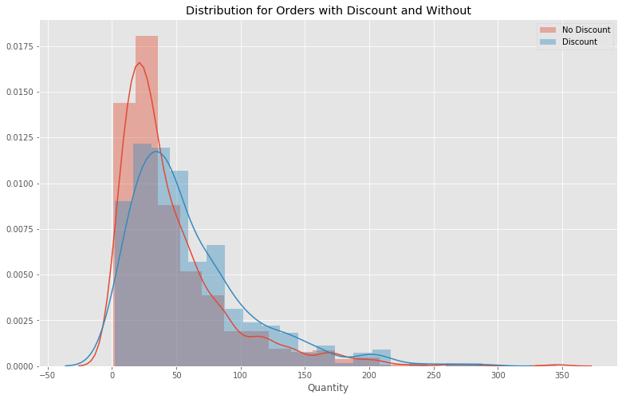
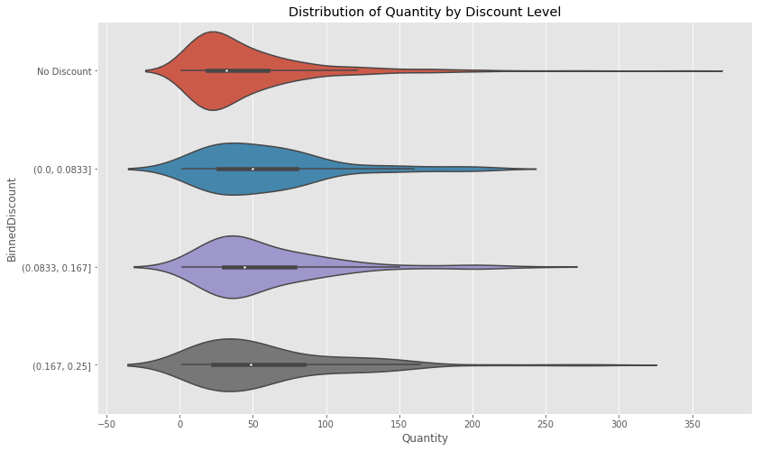
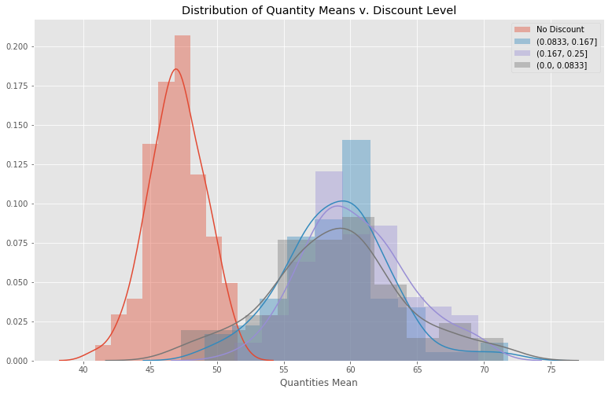

### Question1

- Does discount amount have a statistically significant effect on the quantity of a product in an order? If so, at what level(s) of discount?


Please note the average discount of entire order will be found, not just the each individual line item.  

### Importing Python Module and Establish SQL Connection


```python
from importlib import reload

import numpy as np
import pandas as pd

import sqlite3
conn = sqlite3.Connection('Northwind_small.sqlite')
cur = conn.cursor()

# Removing red warnings
import warnings
warnings.filterwarnings('ignore')

# Power Analysis
from statsmodels.stats.power import tt_ind_solve_power,ttest_power

#For tukey test
from statsmodels.stats.multicomp import pairwise_tukeyhsd
from statsmodels.stats.multicomp import MultiComparison

#
import seaborn as sns
import matplotlib.pyplot as plt
plt.style.use('ggplot')
figsize = (13,8)

import function as func
```

    ip
    

### Function


```python
def sql_to_dataframe(query):
    cur.execute(query)
    
    df = pd.DataFrame(cur.fetchall()) #Take results and create dataframe
    df.columns = [i[0] for i in cur.description]

    return df

```


```python

```

### Creating  dataframe for discount quantity comparsion

Pulling from the database the order details.


```python
query = """
            SELECT o.ID, ProductID, Quantity, Discount, UnitPrice
            FROM 'Order' as o
            JOIN 'OrderDetail' as od
            on o.ID = od.OrderID"""

df = sql_to_dataframe(query)
df.head()
```


<div>
<style scoped>
    .dataframe tbody tr th:only-of-type {
        vertical-align: middle;
    }

    .dataframe tbody tr th {
        vertical-align: top;
    }

    .dataframe thead th {
        text-align: right;
    }
</style>
<table border="1" class="dataframe">
  <thead>
    <tr style="text-align: right;">
      <th></th>
      <th>Id</th>
      <th>ProductId</th>
      <th>Quantity</th>
      <th>Discount</th>
      <th>UnitPrice</th>
    </tr>
  </thead>
  <tbody>
    <tr>
      <th>0</th>
      <td>10248</td>
      <td>11</td>
      <td>12</td>
      <td>0.0</td>
      <td>14.0</td>
    </tr>
    <tr>
      <th>1</th>
      <td>10248</td>
      <td>42</td>
      <td>10</td>
      <td>0.0</td>
      <td>9.8</td>
    </tr>
    <tr>
      <th>2</th>
      <td>10248</td>
      <td>72</td>
      <td>5</td>
      <td>0.0</td>
      <td>34.8</td>
    </tr>
    <tr>
      <th>3</th>
      <td>10249</td>
      <td>14</td>
      <td>9</td>
      <td>0.0</td>
      <td>18.6</td>
    </tr>
    <tr>
      <th>4</th>
      <td>10249</td>
      <td>51</td>
      <td>40</td>
      <td>0.0</td>
      <td>42.4</td>
    </tr>
  </tbody>
</table>
</div>


Calculating the average percent discount for the entire.


```python
# Adding the standard price
df['StandardPrice']= df.UnitPrice/(1- df.Discount)
# Line total
df['LineTotal'] = df.UnitPrice* df.Quantity
# Discounted Amount
df['StandardAmount'] = df.StandardPrice* df.Quantity
df.head()
```


<div>
<style scoped>
    .dataframe tbody tr th:only-of-type {
        vertical-align: middle;
    }

    .dataframe tbody tr th {
        vertical-align: top;
    }

    .dataframe thead th {
        text-align: right;
    }
</style>
<table border="1" class="dataframe">
  <thead>
    <tr style="text-align: right;">
      <th></th>
      <th>Id</th>
      <th>ProductId</th>
      <th>Quantity</th>
      <th>Discount</th>
      <th>UnitPrice</th>
      <th>StandardPrice</th>
      <th>LineTotal</th>
      <th>StandardAmount</th>
    </tr>
  </thead>
  <tbody>
    <tr>
      <th>0</th>
      <td>10248</td>
      <td>11</td>
      <td>12</td>
      <td>0.0</td>
      <td>14.0</td>
      <td>14.0</td>
      <td>168.0</td>
      <td>168.0</td>
    </tr>
    <tr>
      <th>1</th>
      <td>10248</td>
      <td>42</td>
      <td>10</td>
      <td>0.0</td>
      <td>9.8</td>
      <td>9.8</td>
      <td>98.0</td>
      <td>98.0</td>
    </tr>
    <tr>
      <th>2</th>
      <td>10248</td>
      <td>72</td>
      <td>5</td>
      <td>0.0</td>
      <td>34.8</td>
      <td>34.8</td>
      <td>174.0</td>
      <td>174.0</td>
    </tr>
    <tr>
      <th>3</th>
      <td>10249</td>
      <td>14</td>
      <td>9</td>
      <td>0.0</td>
      <td>18.6</td>
      <td>18.6</td>
      <td>167.4</td>
      <td>167.4</td>
    </tr>
    <tr>
      <th>4</th>
      <td>10249</td>
      <td>51</td>
      <td>40</td>
      <td>0.0</td>
      <td>42.4</td>
      <td>42.4</td>
      <td>1696.0</td>
      <td>1696.0</td>
    </tr>
  </tbody>
</table>
</div>


```python
plt.figure(figsize=figsize);
columns = ['Quantity', 'LineTotal', 'StandardAmount', 'Discount']
orders_with_no_discount = df.loc[df.Discount == 0].groupby('Id')[columns].sum()
orders_with_discount = df.loc[df.Discount != 0].groupby('Id')[columns].sum()
sns.distplot(orders_with_no_discount.Quantity, bins = 20, label = 'No Discount');
sns.distplot(orders_with_discount.Quantity, bins = 20, label = 'Discount');
plt.title('Distribution for Orders with Discount and Without');
plt.legend();
```





```python
orders_with_discount.Discount = (orders_with_discount.StandardAmount- orders_with_discount.LineTotal)/ orders_with_discount.StandardAmount 
df_orders = orders_with_discount.append(orders_with_no_discount)
hist, bin_edge = np.histogram(df_orders.Discount, bins= 3)
#bin_edge[1]=.0725
df_orders['BinnedDiscount'] = pd.cut(df_orders['Discount'], bin_edge)
df_orders.BinnedDiscount = df_orders.BinnedDiscount.astype(str)
df_orders.BinnedDiscount.loc[df_orders.BinnedDiscount == 'nan']= 'No Discount'
df_orders = df_orders.sort_values('Discount')
#type(orders_with_discount.BinnedDiscount[0])
```


```python
df_orders.BinnedDiscount.value_counts()
```


    No Discount        613
    (0.0833, 0.167]    150
    (0.167, 0.25]      144
    (0.0, 0.0833]       86
    Name: BinnedDiscount, dtype: int64


```python
plt.figure(figsize= figsize)
plt.title('Distribution of Quantity by Discount Level')
sns.violinplot(x='Quantity', y= 'BinnedDiscount', data= df_orders);
```





#### Check for normality- Sharpio-Welk test


```python
func.shapiro_normal(df_orders.Quantity)
#Overall quantity distribution
```

    non normal
    


    't 0.8211414813995361, p 7.739463034274397e-32'


```python
func.shapiro_normal(df_orders.loc[df_orders.Discount == 0].Quantity)
#Discount quantity distribution
```

    non normal
    


    't 0.7845940589904785, p 1.1666289823246571e-27'


```python
func.shapiro_normal(df_orders.loc[df_orders.Discount != 0].Quantity)
#No discount quantity distribution
```

    non normal
    


    't 0.8644283413887024, p 1.0952017721170508e-17'


```python
for i in df_orders.BinnedDiscount.value_counts().index:
    print(i)
    print(func.shapiro_normal(df_orders.loc[df_orders.BinnedDiscount == i].Quantity))
```

    No Discount
    non normal
    t 0.7845940589904785, p 1.1666289823246571e-27
    (0.0833, 0.167]
    non normal
    t 0.8421576023101807, p 2.0802779637785207e-11
    (0.167, 0.25]
    non normal
    t 0.8608901500701904, p 2.496944873087159e-10
    (0.0, 0.0833]
    non normal
    t 0.8759969472885132, p 6.426521395042073e-07
    

#### Test analysis
The null hypothesis is that the tested distribution is normally distributed, and the alternative hypothesis is that the distribution is non-normal. A p values threshold is 0.05. 

The p values for the order data is below 0.05, so they are not normal. We will use bootstrapping take a sampling distribution of the means.  


```python
df_order_means = pd.DataFrame()
aa = []
bb = []
```


```python
for i in df_orders.BinnedDiscount.value_counts().index:
    a = func.bootstrapping(df_orders.loc[df_orders.BinnedDiscount == i].Quantity, num_of_samples=df_orders.BinnedDiscount.value_counts().min())
    b = [i for j in range(len(a))]
    for j in a:
        aa.append(j)
        bb.append(i)
    df_order_means[i] = a
df_means = pd.DataFrame(aa, columns=['Quantity'])
df_means['BinnedValue'] = bb
```


```python
plt.figure(figsize= figsize)
plt.title('Distribution of Quantity Means v. Discount Level')
plt.xlabel('Quantity')
for i in df_orders.BinnedDiscount.value_counts().index:
    
    sns.distplot(df_order_means[i], label= i,axlabel='Quantities Mean')
    plt.legend()

```





#### Check for normality- Sharpio-Welk test


```python
for i in df_orders.BinnedDiscount.value_counts().index:
    print(i)
    print(func.shapiro_normal(df_order_means[i]))
```

    No Discount
    normal
    t 0.9924347400665283, p 0.9050273895263672
    (0.0833, 0.167]
    normal
    t 0.9831403493881226, p 0.3255539536476135
    (0.167, 0.25]
    normal
    t 0.982770562171936, p 0.3085521161556244
    (0.0, 0.0833]
    normal
    t 0.986225962638855, p 0.4969947636127472
    

#### Test analysis
The null hypothesis is that the tested distribution is normally distributed, and the alternative hypothesis is that the distribution is non-normal. A p values threshold is 0.05. 

The p values for the bootstrap order data are above 0.05, so they are normal. 


#### Variance Test


```python
for i in df_orders.BinnedDiscount.value_counts().index:
    print(f"No Discount compared to {i}")
    print(func.levene_variances(df_order_means['No Discount'], df_order_means[i]))


```

    No Discount compared to No Discount
    p = 1.0
    Therefore the data have equal variances
    True
    No Discount compared to (0.0833, 0.167]
    p = 3.502923887293742e-06
    Therefore the data do not have equal variances
    False
    No Discount compared to (0.167, 0.25]
    p = 5.99797771714921e-07
    Therefore the data do not have equal variances
    False
    No Discount compared to (0.0, 0.0833]
    p = 1.321440131263909e-08
    Therefore the data do not have equal variances
    False
    

#### Test Analysis
The null hypothesis is the variances of the two compared distribution are equal. The alternative hypothesis is the variances are not equal.

The discounted sample means do not have equal variances with the other discount distribution.

#### Effect Size


```python
for i in df_orders.BinnedDiscount.value_counts().index:
    print(f"No Discount compared to {i}")
    print(func.cohen_d(df_order_means[i], df_order_means['No Discount']))
```

    No Discount compared to No Discount
    0.0
    No Discount compared to (0.0833, 0.167]
    3.7601515099983023
    No Discount compared to (0.167, 0.25]
    4.309178544354231
    No Discount compared to (0.0, 0.0833]
    3.108343242404973
    

There is a fairly large effect size for No Discount versus no discount.


###  Tukey Test


```python
mc = MultiComparison(df_means.Quantity, df_means.BinnedValue)
result = mc.tukeyhsd()
result_df = pd.DataFrame(data=result._results_table.data[1:], columns=result._results_table.data[0])
result_df
```


<div>
<style scoped>
    .dataframe tbody tr th:only-of-type {
        vertical-align: middle;
    }

    .dataframe tbody tr th {
        vertical-align: top;
    }

    .dataframe thead th {
        text-align: right;
    }
</style>
<table border="1" class="dataframe">
  <thead>
    <tr style="text-align: right;">
      <th></th>
      <th>group1</th>
      <th>group2</th>
      <th>meandiff</th>
      <th>lower</th>
      <th>upper</th>
      <th>reject</th>
    </tr>
  </thead>
  <tbody>
    <tr>
      <th>0</th>
      <td>(0.0, 0.0833]</td>
      <td>(0.0833, 0.167]</td>
      <td>0.0301</td>
      <td>-1.5128</td>
      <td>1.5731</td>
      <td>False</td>
    </tr>
    <tr>
      <th>1</th>
      <td>(0.0, 0.0833]</td>
      <td>(0.167, 0.25]</td>
      <td>1.4900</td>
      <td>-0.0529</td>
      <td>3.0329</td>
      <td>False</td>
    </tr>
    <tr>
      <th>2</th>
      <td>(0.0, 0.0833]</td>
      <td>No Discount</td>
      <td>-11.9985</td>
      <td>-13.5415</td>
      <td>-10.4556</td>
      <td>True</td>
    </tr>
    <tr>
      <th>3</th>
      <td>(0.0833, 0.167]</td>
      <td>(0.167, 0.25]</td>
      <td>1.4599</td>
      <td>-0.0830</td>
      <td>3.0028</td>
      <td>False</td>
    </tr>
    <tr>
      <th>4</th>
      <td>(0.0833, 0.167]</td>
      <td>No Discount</td>
      <td>-12.0287</td>
      <td>-13.5716</td>
      <td>-10.4858</td>
      <td>True</td>
    </tr>
    <tr>
      <th>5</th>
      <td>(0.167, 0.25]</td>
      <td>No Discount</td>
      <td>-13.4886</td>
      <td>-15.0315</td>
      <td>-11.9457</td>
      <td>True</td>
    </tr>
  </tbody>
</table>
</div>


### Test Analysis
There are statistical difference in the means of the discounted order quantity versus non discounted orders. Also there was not a significant difference among the different levels of discounted orders. These results indicate that having a discount has an effect on the quantity of the purchase, but the level of the discount does not seem to have effect after discount is applied. 


```python
orders_with_discount.Quantity.mean(), orders_with_no_discount.Quantity.mean(), orders_with_discount.Quantity.mean()-orders_with_no_discount.Quantity.mean()
```


    (59.78421052631579, 46.65415986949429, 13.130050656821496)


There is a 13.1 quantity increase in the quantity with a discount. 


```python
!jupyter nbconvert --to markdown question1
```

    [NbConvertApp] Converting notebook question1.ipynb to markdown
    [NbConvertApp] Support files will be in question1_files\
    [NbConvertApp] Making directory question1_files
    [NbConvertApp] Making directory question1_files
    [NbConvertApp] Making directory question1_files
    [NbConvertApp] Writing 13281 bytes to question1.md
    


```python

```
