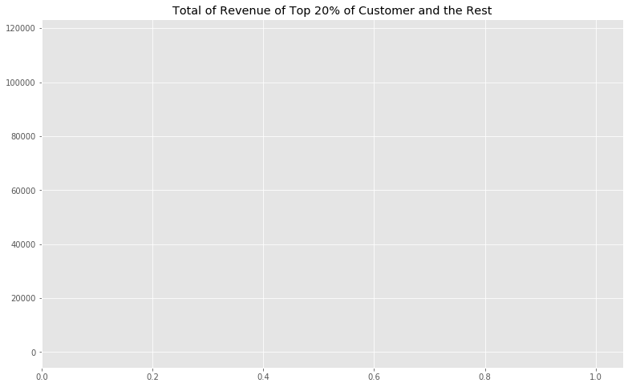

### Question 3
Does the Northwind Customer database conform to the 80/20 rule, 80% of your sales is accounted for by 20% of your customers. 

We will answer this question by first determining if there is a statistically significant difference in the mean revenue of the top 20 percentile of customers by total revenue and that of all the customers. 


### Importing Python Module 


```python
from importlib import reload

import numpy as np
import pandas as pd

import sqlite3

# Removing red warnings
import warnings
warnings.filterwarnings('ignore')

# Power Analysis
from statsmodels.stats.power import tt_ind_solve_power,ttest_power

#For tukey test
from statsmodels.stats.multicomp import pairwise_tukeyhsd
from statsmodels.stats.multicomp import MultiComparison

#
import seaborn as sns
import matplotlib.pyplot as plt
import matplotlib.ticker as ticker
plt.style.use('ggplot')
figsize = (13,8)

import function as func

import scipy.stats as scs

```


```python
conn = func.MyConn(filename= 'Northwind_small.sqlite')
```


```python
query =  """
            SELECT o.ID, CustomerID, ProductID, Quantity, Discount, UnitPrice
            FROM 'Order' as o
            JOIN 'OrderDetail' as od
            on o.ID = od.OrderID 
        """

```


```python
df = conn.load_query_as_df(query)
# Line total
df['LineTotal'] = df.UnitPrice* df.Quantity
```


```python
columns = ['Quantity', 'LineTotal']
df_customer = df.groupby('CustomerId')[columns].sum()

df_customer = df_customer.rename(columns= {'LineTotal':'Revenue'})
df_customer.head()
```


<div>
<style scoped>
    .dataframe tbody tr th:only-of-type {
        vertical-align: middle;
    }

    .dataframe tbody tr th {
        vertical-align: top;
    }

    .dataframe thead th {
        text-align: right;
    }
</style>
<table border="1" class="dataframe">
  <thead>
    <tr style="text-align: right;">
      <th></th>
      <th>Quantity</th>
      <th>Revenue</th>
    </tr>
    <tr>
      <th>CustomerId</th>
      <th></th>
      <th></th>
    </tr>
  </thead>
  <tbody>
    <tr>
      <th>ALFKI</th>
      <td>174</td>
      <td>4596.20</td>
    </tr>
    <tr>
      <th>ANATR</th>
      <td>63</td>
      <td>1402.95</td>
    </tr>
    <tr>
      <th>ANTO</th>
      <td>359</td>
      <td>7515.35</td>
    </tr>
    <tr>
      <th>AROUT</th>
      <td>650</td>
      <td>13806.50</td>
    </tr>
    <tr>
      <th>BERGS</th>
      <td>1001</td>
      <td>26968.15</td>
    </tr>
  </tbody>
</table>
</div>


```python
df_customer['Top20']= df_customer.Revenue >=df_customer.Revenue.quantile(.8)
df_customer[] =df_binning(df_customer, 'Revenue', bins= 10, new_column_name= 'BinnedDiscount')
```


```python
df_customer.groupby('Top20').sum()
```


<div>
<style scoped>
    .dataframe tbody tr th:only-of-type {
        vertical-align: middle;
    }

    .dataframe tbody tr th {
        vertical-align: top;
    }

    .dataframe thead th {
        text-align: right;
    }
</style>
<table border="1" class="dataframe">
  <thead>
    <tr style="text-align: right;">
      <th></th>
      <th>Quantity</th>
      <th>Revenue</th>
    </tr>
    <tr>
      <th>Top20</th>
      <th></th>
      <th></th>
    </tr>
  </thead>
  <tbody>
    <tr>
      <th>False</th>
      <td>21498</td>
      <td>531870.50</td>
    </tr>
    <tr>
      <th>True</th>
      <td>29819</td>
      <td>822588.09</td>
    </tr>
  </tbody>
</table>
</div>


```python
df_customer.groupby('Top20').count()
```


<div>
<style scoped>
    .dataframe tbody tr th:only-of-type {
        vertical-align: middle;
    }

    .dataframe tbody tr th {
        vertical-align: top;
    }

    .dataframe thead th {
        text-align: right;
    }
</style>
<table border="1" class="dataframe">
  <thead>
    <tr style="text-align: right;">
      <th></th>
      <th>Quantity</th>
      <th>Revenue</th>
    </tr>
    <tr>
      <th>Top20</th>
      <th></th>
      <th></th>
    </tr>
  </thead>
  <tbody>
    <tr>
      <th>False</th>
      <td>71</td>
      <td>71</td>
    </tr>
    <tr>
      <th>True</th>
      <td>18</td>
      <td>18</td>
    </tr>
  </tbody>
</table>
</div>


```python
df_customer.loc[df_customer.Revenue >=df_customer.Revenue.quantile(.8)].Revenue.sum()/ df_customer.Revenue.sum()
```


    0.6073187442371346


```python
func.plotset(title= 'Distribution of Sample Mean of Revenue by Customer');
sns.distplot(df_customer.Revenue, label='All');
sns.distplot(df_customer.loc[df_customer.Top20 == False].Revenue, color='green', label= 'Bottom 80%');
sns.distplot(df_customer.loc[df_customer.Top20 == True].Revenue, color='blue', label= 'Top 20%', bins= 20);
plt.legend();
```


```python
df_customer.loc[df_customer.Top20 == True].Revenue.mean()
```


    45699.33833333333


#### Normalilty Shapiro Welk Test


```python
for i in df_customer.Top20.value_counts().index:
    print(i)
    print(func.shapiro_normal(df_customer.loc[df_customer.Top20 == i].Revenue))
```

    False
    non normal
    t 0.8955289721488953, p 2.296842467330862e-05
    True
    non normal
    t 0.6525330543518066, p 2.3559050532639958e-05
    

#### Test analysis
The null hypothesis is that the tested distribution is normally distributed, and the alternative hypothesis is that the distribution is non-normal. A p values threshold is 0.05.

*Null hypothesis was rejected.* The p-values are below the threshold, so the distrbutions are non normal. Will bootstrap.


```python

total = func.bootstrapping(df_customer.Revenue, num_of_samples=89)
Top20 = func.bootstrapping(df_customer.loc[df_customer.Top20 == True].Revenue, num_of_samples=18)
Bottom80 = func.bootstrapping(df_customer.loc[df_customer.Top20 == False].Revenue, num_of_samples=71)
func.plotset(title= 'Distribution of Sample Mean of Revenue by Customer');
sns.distplot(total, label='All Sample');
sns.distplot(Bottom80, color='green', label= 'Bottom 80%');
sns.distplot(Top20, color='blue', label= 'Top 20%', bins= 20);
plt.legend();
```


```python
df_customer.Revenue.mean()
```


    15218.63584269663


#### Normalilty Shapiro Welk Test


```python
print('Total')
print(func.shapiro_normal(total))
print('Bottom 80%')
print(func.shapiro_normal(Bottom80))
print('Top 20%')
print(func.shapiro_normal(Top20))
```

    Total
    normal
    t 0.977672815322876, p 0.12825900316238403
    Bottom 80%
    normal
    t 0.9854987859725952, p 0.5879389047622681
    Top 20%
    normal
    t 0.9074409008026123, p 0.07755468785762787
    

#### Test Analysis
The null hypothesis is that the tested distribution is normally distributed, and the alternative hypothesis is that the distribution is non-normal. A p values threshold is 0.05.

*Null hypothesis was not rejected for all samples.* The p-values are below the threshold, so the distrbutions are normal. 

#### Welch T-test 


```python
scs.ttest_ind(Top20, total)
```


    Ttest_indResult(statistic=31.68932297270785, pvalue=1.447544523130821e-55)


#### Test analysis
*Rejected the null hypothesis*(the sample means are identical)

#### Effect Size


```python
effect_size = func.cohen_d(Top20, total)
effect_size
```


    8.189805612322393


```python
tt_ind_solve_power(effect_size=effect_size, nobs1=18, alpha=0.5)
```


    1.0


```python
print(np.mean(df_customer.Revenue)) 
print(np.mean(df_customer.loc[df_customer.Top20].Revenue))
print(np.mean(df_customer.loc[df_customer.Top20].Revenue) - np.mean(df_customer.Revenue))
```

    15218.63584269663
    45699.33833333333
    30480.7024906367
    

### Conclusion 
There a statistically significant difference in the mean revenue of the top 20 percentile of customers by total revenue and that of all the customers. There is a $30,480.70 positive increase the average revenue of the whole customer base to the average revenue  among the top 20% of customers. 


```python
func.plotset(title= 'Total of Revenue of Top 20% of Customer and the Rest')
#sns.barplot(df_customer.Top20, df_customer.Revenue);
plt.barh(df_customer.Revenue, df_customer.Top20)
```


    <BarContainer object of 89 artists>





```python
!jupyter nbconvert --to markdown question3
```

    [NbConvertApp] Converting notebook Question2.ipynb to markdown
    [NbConvertApp] Support files will be in Question2_files\
    [NbConvertApp] Making directory Question2_files
    [NbConvertApp] Making directory Question2_files
    [NbConvertApp] Making directory Question2_files
    [NbConvertApp] Making directory Question2_files
    [NbConvertApp] Writing 14155 bytes to Question2.md
    


```python
print(func.shapiro_normal(df_customer.loc[df_customer.BinnedDiscount == i].TotalSpent))
```


    ---------------------------------------------------------------------------

    AttributeError                            Traceback (most recent call last)

    <ipython-input-97-74f1d299240d> in <module>()
    ----> 1 print(func.shapiro_normal(df_customer.loc[df_customer.BinnedDiscount == i].TotalSpent))
    

    ~\.conda\envs\learn-env\lib\site-packages\pandas\core\generic.py in __getattr__(self, name)
       4374             if self._info_axis._can_hold_identifiers_and_holds_name(name):
       4375                 return self[name]
    -> 4376             return object.__getattribute__(self, name)
       4377 
       4378     def __setattr__(self, name, value):
    

    AttributeError: 'DataFrame' object has no attribute 'BinnedDiscount'

