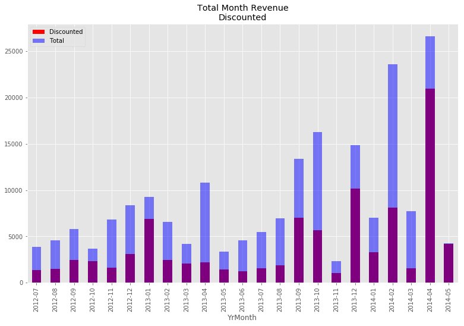
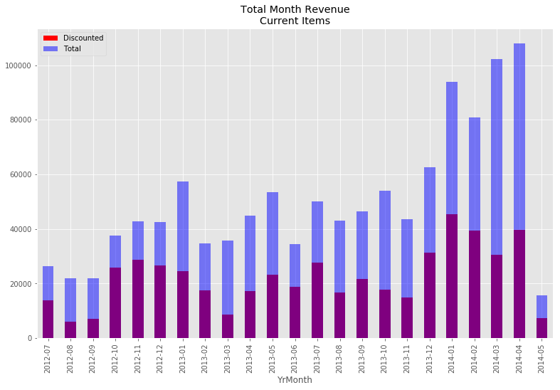
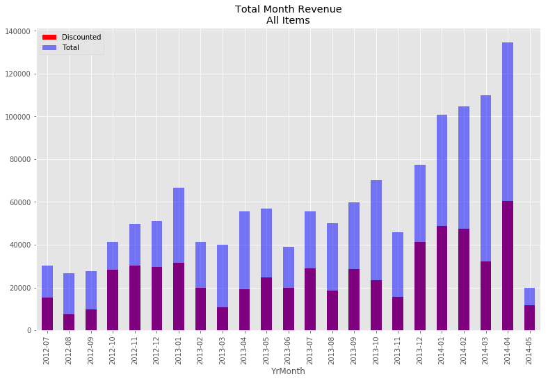
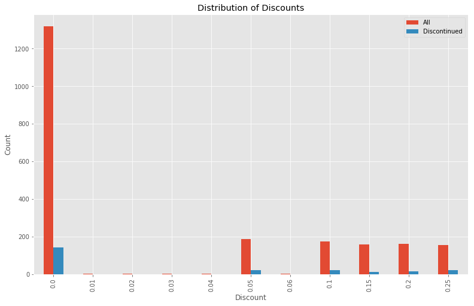
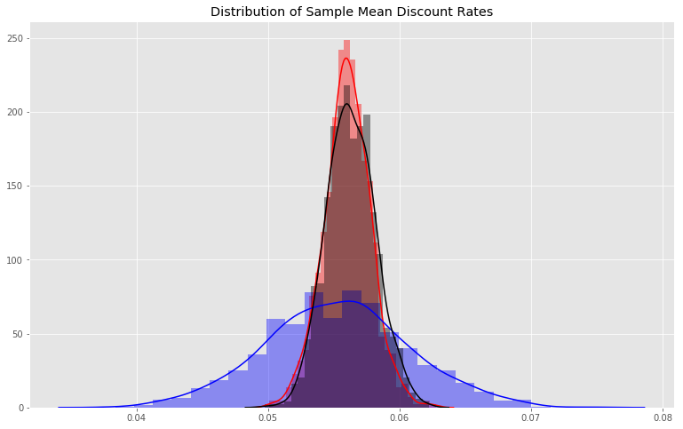

### Question 4
Are discontinued items have a difference discount rate compared to the rest of the items?

### Importing Python Module 


```python
from importlib import reload

import numpy as np
import pandas as pd

import sqlite3

# Removing red warnings
import warnings
warnings.filterwarnings('ignore')

# Power Analysis
from statsmodels.stats.power import tt_ind_solve_power,ttest_power

#For tukey test
from statsmodels.stats.multicomp import pairwise_tukeyhsd
from statsmodels.stats.multicomp import MultiComparison

#
import seaborn as sns
import matplotlib.pyplot as plt
plt.style.use('ggplot')
figsize = (13,8)

import function as func

import scipy.stats as scs

```

    ip
    


```python
conn = func.MyConn(filename= 'Northwind_small.sqlite')
```


```python
query =  """
            SELECT o.OrderDate, od.UnitPrice, od.Quantity, p.Discontinued, od.Discount
            from OrderDetail as od
            join 'Order' as o
            on o.Id = od.OrderId
            join Product as p
            on p.Id = od.ProductId
        """

```


```python
conn.get_table_description(table_name='OrderDetail')
```


    ['Id', 'OrderId', 'ProductId', 'UnitPrice', 'Quantity', 'Discount']


```python
df = conn.load_query_as_df(query)
df['Total'] = df.Quantity* df.UnitPrice
df['DateTimeOrder'] = pd.to_datetime(df.OrderDate)
df['YrMonth'] = df.OrderDate.apply(lambda x: x[:7])
df['Count'] = df.OrderDate.apply(lambda x:1)
df.head()
```


<div>
<style scoped>
    .dataframe tbody tr th:only-of-type {
        vertical-align: middle;
    }

    .dataframe tbody tr th {
        vertical-align: top;
    }

    .dataframe thead th {
        text-align: right;
    }
</style>
<table border="1" class="dataframe">
  <thead>
    <tr style="text-align: right;">
      <th></th>
      <th>OrderDate</th>
      <th>UnitPrice</th>
      <th>Quantity</th>
      <th>Discontinued</th>
      <th>Discount</th>
      <th>Total</th>
      <th>DateTimeOrder</th>
      <th>YrMonth</th>
      <th>Count</th>
    </tr>
  </thead>
  <tbody>
    <tr>
      <th>0</th>
      <td>2012-07-04</td>
      <td>14.0</td>
      <td>12</td>
      <td>0</td>
      <td>0.0</td>
      <td>168.0</td>
      <td>2012-07-04</td>
      <td>2012-07</td>
      <td>1</td>
    </tr>
    <tr>
      <th>1</th>
      <td>2012-07-04</td>
      <td>9.8</td>
      <td>10</td>
      <td>1</td>
      <td>0.0</td>
      <td>98.0</td>
      <td>2012-07-04</td>
      <td>2012-07</td>
      <td>1</td>
    </tr>
    <tr>
      <th>2</th>
      <td>2012-07-04</td>
      <td>34.8</td>
      <td>5</td>
      <td>0</td>
      <td>0.0</td>
      <td>174.0</td>
      <td>2012-07-04</td>
      <td>2012-07</td>
      <td>1</td>
    </tr>
    <tr>
      <th>3</th>
      <td>2012-07-05</td>
      <td>18.6</td>
      <td>9</td>
      <td>0</td>
      <td>0.0</td>
      <td>167.4</td>
      <td>2012-07-05</td>
      <td>2012-07</td>
      <td>1</td>
    </tr>
    <tr>
      <th>4</th>
      <td>2012-07-05</td>
      <td>42.4</td>
      <td>40</td>
      <td>0</td>
      <td>0.0</td>
      <td>1696.0</td>
      <td>2012-07-05</td>
      <td>2012-07</td>
      <td>1</td>
    </tr>
  </tbody>
</table>
</div>


```python
func.plotset(title= 'Total Month Revenue\nDiscounted')

df.loc[df.Discontinued == 1].loc[df.Discount > 0].groupby('YrMonth').sum().Total.plot(kind='bar', color='red', 
                                                                                      alpha =1, label='Discounted');
df.loc[df.Discontinued == 1].loc[df.Discount >= 0
                                ].groupby('YrMonth').sum().Total.plot(kind='bar', color='blue', 
                                                                      alpha =0.5, label= 'Total');
plt.legend();

```





```python
func.plotset(title= 'Total Month Revenue\nCurrent Items')
df.loc[df.Discontinued == 0].loc[df.Discount > 0].groupby('YrMonth').sum().Total.plot(kind='bar', color='red', 
                                                                                      alpha =1, label='Discounted');
df.loc[df.Discontinued == 0].loc[df.Discount >= 0].groupby('YrMonth').sum().Total.plot(kind='bar', color='blue', 
                                                                                       alpha =0.5, label='Total');
plt.legend();
```





```python
func.plotset(title= 'Total Month Revenue\nAll Items')
df.loc[df.Discount > 0].groupby('YrMonth').sum().Total.plot(kind='bar', color='red', alpha =1, label='Discounted');
df.loc[df.Discount >= 0].groupby('YrMonth').sum().Total.plot(kind='bar', color='blue', alpha =0.5, label='Total');
plt.legend();
```





```python
a = df.groupby(['Discount'])['Count', 'Discontinued'].sum()
a = a.rename(columns={'Count':'All'})
ax = a.plot.bar(figsize=(13,8));
plt.title('Distribution of Discounts');
plt.ylabel('Count');

```





#### Check for normality- Sharpio-Welk test


```python
print('All')
print(func.shapiro_normal(df.Discount))
print('Discontinued')
print(func.shapiro_normal(df.loc[df.Discontinued == 1].Discount))
print('Normal')
print(func.shapiro_normal(df.loc[df.Discontinued == 0].Discount))
```

    All
    non normal
    t 0.6950738430023193, p 0.0
    Discontinued
    non normal
    t 0.6778910160064697, p 1.3102864828060304e-20
    Normal
    non normal
    t 0.6968779563903809, p 0.0
    


```python

```

#### Test analysis
The null hypothesis is that the tested distribution is normally distributed, and the alternative hypothesis is that the distribution is non-normal. A p values threshold is 0.05.

Reject the null hypothesis. All 3 distrbutions are non normal. Will use bootstrapping and will examine sample means.


```python
all_sample_mean = func.bootstrapping(df.Discount, num_of_samples=1000)
```


```python
discontinued_sample_mean = func.bootstrapping(df.loc[df.Discontinued == 1].Discount, 
                                          num_of_samples=1000)
```


```python
normal_sample_mean = func.bootstrapping(df.loc[df.Discontinued == 0].Discount,
                                        num_of_samples=1000)
```


```python
func.plotset(title='Distribution of Sample Mean Discount Rates')
sns.distplot(all_sample_mean, label='Total', color='red')
sns.distplot(discontinued_sample_mean, label='Discontinued', color='blue')
sns.distplot(normal_sample_mean, label='Normal',color='black')
```


    <matplotlib.axes._subplots.AxesSubplot at 0x11a31d432b0>





#### Check for normality- Sharpio-Welk test


```python
print('All')
print(func.shapiro_normal(all_sample_mean))
print('Discontinued')
print(func.shapiro_normal(discontinued_sample_mean))
print('Normal')
print(func.shapiro_normal(normal_sample_mean))
```

    All
    non normal
    t 0.9964560270309448, p 0.023196538910269737
    Discontinued
    normal
    t 0.9987639784812927, p 0.7313024997711182
    Normal
    normal
    t 0.998462438583374, p 0.5303573608398438
    


```python

```

#### Test analysis
The null hypothesis is that the tested distribution is normally distributed, and the alternative hypothesis is that the distribution is non-normal. A p values threshold is 0.05.

The null failed to be rejected. The distrubtion can be considered normal.

#### Variance Test


```python
# Total distribution Versus the non discontinued sample.
func.levene_variances(all_sample_mean, normal_sample_mean)
```

    p = 0.04816569617190274
    Therefore the data do not have equal variances
    


    False


```python
# Total distribtuion versus the discontinued samples.
func.levene_variances(all_sample_mean, discontinued_sample_mean)
```

    p = 1.2284988167112896e-134
    Therefore the data do not have equal variances
    


    False


```python
#Non discontinued samples versus the discontinued samples
func.levene_variances(discontinued_sample_mean, normal_sample_mean)
```

    p = 3.854038813759604e-127
    Therefore the data do not have equal variances
    


    False


The discontinued samples had difference variance compared to the other distributions.

#### Effect Size


```python
# Total distribution Versus the non discontinued sample.
func.cohen_d(all_sample_mean, normal_sample_mean)
```


    -0.1523233592759832


```python
# Total distribtuion versus the discontinued samples.
func.cohen_d(all_sample_mean, discontinued_sample_mean)
```


    0.1826323674984884


```python
#Non discontinued samples versus the discontinued samples
func.cohen_d(discontinued_sample_mean, normal_sample_mean)
```


    -0.2499484603113419


The effect size are not very big, and would cause question a reject of the null hypothesis in a Welch's T test

#### Welch T Test


```python
scs.ttest_ind(discontinued_sample_mean, normal_sample_mean, equal_var=False)
```


    Ttest_indResult(statistic=-5.589017481275687, pvalue=2.8111357710968543e-08)


```python
scs.ttest_ind(all_sample_mean, discontinued_sample_mean, equal_var=False)
```


    Ttest_indResult(statistic=4.083783886183433, pvalue=4.7219796460801225e-05)


#### Test analysis
Rejected the null hypothesis(the sample means are identical)


### Conclusion 
There is not statistical signficant difference in between discount rate of the discontinued items versus either 


```python
!jupyter nbconvert --to markdown 
```

    [NbConvertApp] Converting notebook question4.ipynb to markdown
    [NbConvertApp] Writing 6361 bytes to question4.md
    


```python

```
